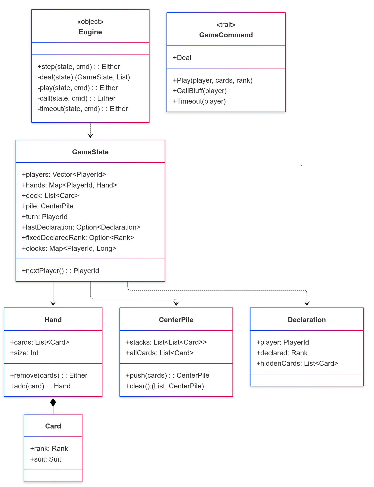
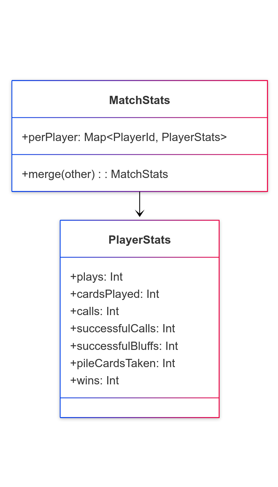
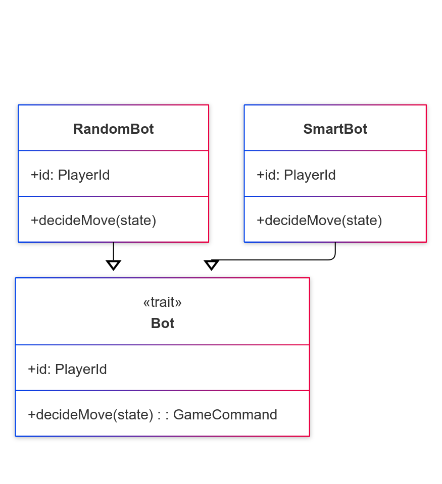
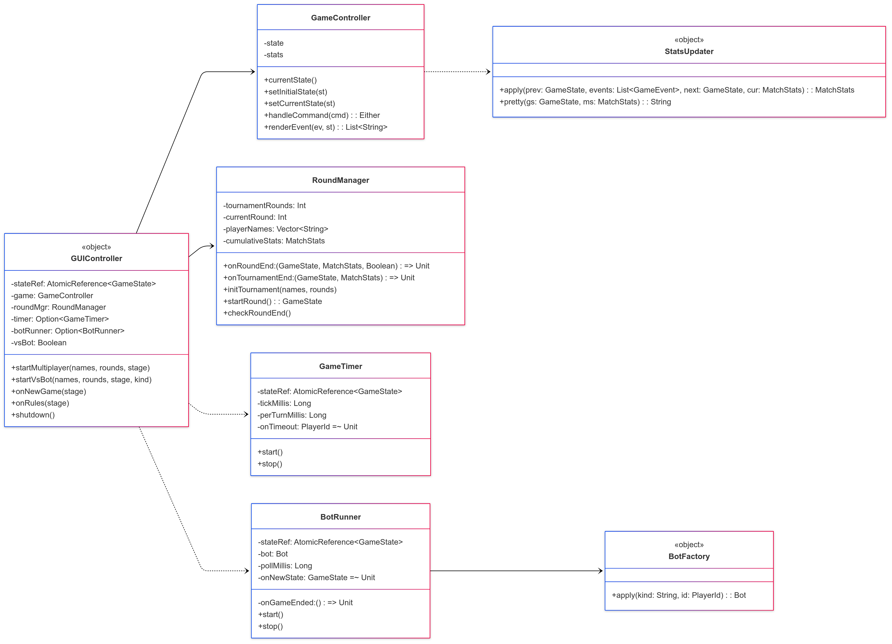
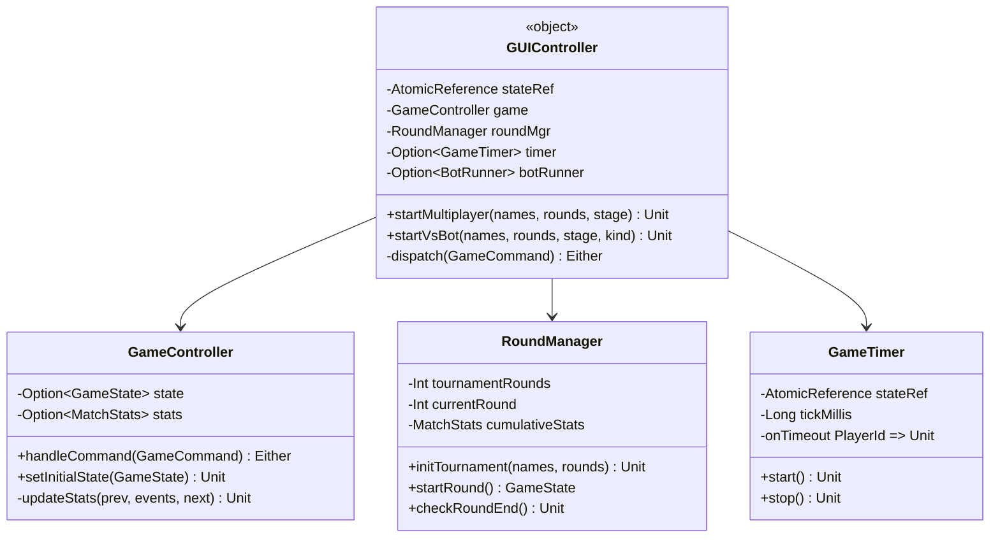
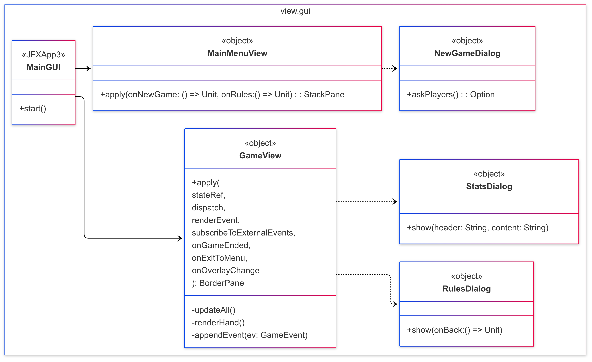
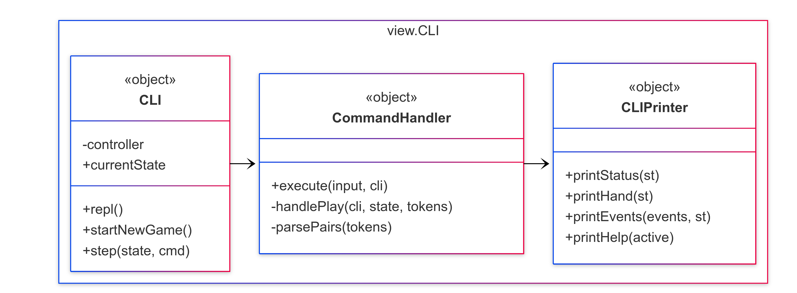

# Design di dettaglio

## Model
Il Model incapsula l'intera logica di business del gioco Bluff, garantendo immutabilità e purezza funzionale. Di seguito sono riportate le principali scelte di design che hanno guidato l'implementazione di questo componente architetturale. 

### Gestione dello Stato di Gioco
<div align="center">
  
</div>

Lo stato del gioco è modellato attraverso la case class immutabile `GameState`, che rappresenta una fotografia completa del gioco in un dato momento. L'immutabilità garantisce thread-safety e facilita il debugging, permettendo di tracciare l'evoluzione del gioco attraverso stati successivi.

L'`Engine` implementa il pattern **Command** per processare le azioni di gioco. Ogni comando (`Play`, `CallBluff`, `Timeout`) viene validato e trasformato in una tupla `(newState, events)`, mantenendo la purezza funzionale:

```scala
def step(state: GameState, cmd: GameCommand): 
  Either[String, (GameState, List[GameEvent])]
```

Questa architettura event-driven permette di:
- Separare la logica di business dalla presentazione
- Facilitare il testing attraverso stati deterministici
- Implementare facilmente funzionalità come replay o undo

### Gestione statistiche
<div align="center">
  
</div>

Il sistema di statistiche è progettato come una pipeline di trasformazioni funzionali pure. `StatsUpdater` è un object che implementa una funzione di fold sugli eventi, aggiornando incrementalmente le statistiche:

```scala
def apply(prev: GameState, events: List[GameEvent], 
         next: GameState, cur: MatchStats): MatchStats
```

Le statistiche sono strutturate gerarchicamente:
- `PlayerStats`: Metriche individuali per giocatore
- `MatchStats`: Aggregazione per singola partita
- Statistiche cumulative: Gestite da `RoundManager` per tornei multi-round

### Bot
<div align="center">
  
</div>

Per la creazione dei bot viene utilizzato il pattern **Factory Method** attraverso `BotFactory`, che permette di istanziare diverse tipologie di bot in base a una stringa di configurazione:

```scala
object BotFactory:
  def apply(kind: String, id: PlayerId): Bot = kind match
    case "smart"  => SmartBot(id)
    case "random" => RandomBot(id)
    case _        => RandomBot(id)
```

Il pattern **Strategy** è implementato per le diverse strategie di gioco dei bot:
- `RandomBot`: Implementa una strategia casuale con probabilità configurabili
- `SmartBot`: Analizza lo stato di gioco, conta le carte e prende decisioni strategiche basate su probabilità

## Controller
Il Controller implementa il pattern **Facade** per orchestrare la complessità del sistema, mantenendo una separazione pulita tra coordinamento e logica di business.
### GameController - State Management

<div align="center">
  
</div>

`GameController` gestisce lo stato corrente e le statistiche attraverso:
- **Encapsulation**: Stato privato con accesso controllato
- **Command Processing**: Validazione e esecuzione comandi tramite Engine
- **Event Rendering**: Trasformazione eventi in rappresentazioni leggibili

```scala
def handleCommand(cmd: GameCommand): Either[String, List[GameEvent]] =
  state match
    case Some(st) => 
      Engine.step(st, cmd).map { case (st2, evs) =>
        state = Some(st2)
        updateStats(prev, evs, st2)
        evs
      }
```
### GUIController - Orchestration Laye
`GUIController` (Singleton) implementa il pattern **Coordinator** per gestire:

1. **Lifecycle Management**:
   - Inizializzazione e cleanup di timer e bot runner
   - Transizioni tra menu, gioco e statistiche

2. **Dependency Wiring**:
   ```scala
   BotManager.executeCommand = cmd => 
     game.handleCommand(cmd).map { evs =>
       (game.currentState.get, evs)
     }
   ```

3. **Event Distribution**:
   - Eventi utente → Controller → Engine
   - Eventi bot → BotManager → Controller → View
   - Eventi timer → Controller → Engine



## View
La View implementa una separazione netta tra presentazione e logica, utilizzando callback e reactive programming per mantenere l'indipendenza dal Model.

`GameView` implementa il pattern **Observer** attraverso un sistema di callback e `AtomicReference`:

```scala
def apply(
  stateRef: AtomicReference[GameState],
  dispatch: GameCommand => Either[String, List[GameEvent]],
  renderEvent: (GameEvent, GameState) => List[String],
  subscribeToExternalEvents: (List[GameEvent] => Unit) => Unit,
  ...
): BorderPane
```

Caratteristiche principali:
- **Dependency Injection via Callback**: La View non conosce Controller o Engine, riceve solo funzioni
- **Reactive Updates**: Osserva cambiamenti di stato tramite `AtomicReference`
- **Event Subscription**: Si registra per ricevere eventi esterni (bot) senza coupling diretto

### Gui
<div align="center">
  
</div>
L'interfaccia grafica è costruita con ScalaFX (wrapper Scala per JavaFX), sfruttando il paradigma dichiarativo e la type-safety di Scala.
#### Card Rendering System
Il rendering delle carte utilizza un sistema ibrido immagini/fallback:
```scala
object CardNode {
  private def imagePath(card: Card): String = {
    val suit = suitFolder(card.suit)
    val rank = rankToken(card.rank)
    s"/cards/${suit}_${rank}.png"
  }
  
  // Tentativo di caricamento immagine con fallback testuale
  private val maybeStream = Option(getClass.getResourceAsStream(imagePath(card)))
  children = maybeStream match
    case Some(stream) => new ImageView(new Image(stream))
    case None => new Label(s"${card.rank} ${suitSymbol(card.suit)}")
}
```
Caratteristiche del sistema:

Resource Loading: Carica immagini PNG dalle risorse embedded
Graceful Degradation: Fallback a rappresentazione testuale se immagine mancante
Visual Feedback: Cambio stile per carte selezionate (bordo colorato + shadow)

#### Privacy Overlay Implementation
L'overlay privacy è implementato usando StackPane e effetti grafici:
```scala
private val overlayPane = new VBox {
  style = "-fx-background-color: rgba(0,0,0,0.60);"
  children = Seq(
    new Label("Passa il dispositivo al prossimo giocatore"),
    overlayLabel,  // Nome del prossimo giocatore
    btnReady       // Bottone conferma
  )
}

private def showOverlay(next: PlayerId): Unit = {
  centerContent.effect = new GaussianBlur(16)
  overlayPane.visible = true
  actions.disable = true
  handPane.visible = false
  onOverlayChange(true)  // Notifica controller per pausare timer
}
```
### CLI
<div align="center">
  
</div>

L'interfaccia CLI implementa un Read-Eval-Print Loop (REPL) classico, offrendo un'alternativa testuale alla GUI:
```scala
object CLI:
  def repl(): Unit =
    running = true
    println("Comandi: new | bot | help | quit")
    while running do
      print("> ")
      val line = Option(StdIn.readLine()).getOrElse("")
      CommandHandler.execute(line.trim, this)
```
#### Command Parsing System
Il sistema di parsing dei comandi utilizza pattern matching e parsing funzionale:
```scala
object CommandHandler:
  def execute(input: String, cli: CLI.type): Unit =
    input.split("\\s+").toList match
      case "new" :: _         => cli.startNewGame()
      case "bot" :: _         => cli.startNewGameVSBot()
      case "play" :: tokens   => handlePlay(cli, state, tokens)
      case "call" :: _        => cli.step(state, GameCommand.CallBluff(state.turn))
      case "status" :: _      => CLIPrinter.printStatus(state)
      case "quit" :: _        => cli.quit()
      case _ => println(s"Comando sconosciuto: $input")
```
#### Sintassi Comandi Avanzata
Il comando play supporta una sintassi complessa per giocare multiple carte:
```scala
play <quantità> <rango> [<quantità> <rango> ...]
```
Esempi:

-play 2 asso - Gioca 2 assi
-play 1 re 2 donna - Gioca 1 re e 2 donne
-play 3 7 - Gioca 3 carte di valore 7

Il parsing gestisce:
```scala
private def parsePairs(tokens: List[String]): Either[String, List[(Int, Rank)]] =
  tokens.grouped(2).toList.map { g =>
    val qStr = g(0)
    val rankStr = g(1)
    qStr.toIntOption match
      case Some(q) if q > 0 => 
        CLIPrinter.parseRank(rankStr).map(rk => (q, rk))
      case _ => 
        Left(s"Quantità non valida: $qStr")
  }.sequence  // Converte List[Either] in Either[List]
```